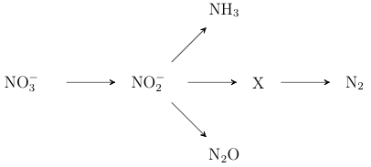

Variational Reformulation of Bayesian Inverse Problems
================================================================

**Panagiotis Tsilifis<sup>1</sup>, Ilias Bilionis<sup>2,*</sup>, Ioannis Katsounaros<sup>3,4,5</sup> Nicholas Zabaras<sup>6</sup>**

<sup>1</sup>
Department of Mathematics, University of Southern California, Los Angeles, CA 90089-2532, USA

<sup>2</sup>
School of Mechanical Engineering, Purdue University, 585 Purdue Mall, West Lafayette, IN 47906-2088, USA

<sup>3</sup>
Department of Chemistry, University of Illinois at Urbana-Champaign, S. Mathews Ave., Urbana, IL 61801, USA

<sup>4</sup>
Materials Science Division, Argonne National Laboratory, 9700 S. Cass Ave., Lemont, IL 60439, USA

<sup>5</sup>
Leiden Institute of Chemistry, Leiden University, Einsteinweg 55, P.O. Box 9502, 2300 RA Leiden, The Netherlands

<sup>6</sup>
Warwick Centre for Predictive Modelling, University of Warwick, Coventry, CV4 7 AL, UK

<sup>*</sup>
Corresponding author.

E-mail: {<tsilifis@usc.edu>, <ibilion@purdue.edu>, <katsounaros@anl.gov>, <nzabaras@gmail.com>}

#### Abstract
The classical approach to inverse problems is based on the optimization of a misfit function. Despite its computational appeal, such an approach suffers from many shortcomings, e.g., non-uniqueness of solutions. The Bayesian formalism to inverse problems avoids most of the difficulties encountered by the optimization approach, albeit at an increased computational cost. In this work, we use information theoretic arguments in order to cast the Bayesian inference problem in terms of an optimization problem. The resulting scheme combines the theoretical soundness of fully Bayesian inference with the computational efficiency of a simple optimization.

Submitted to: *Inverse Problems*

What does this page contain?
----------------------------

This page contains the Python code we developed for this paper.
The code implements the methodology of the paper.
It can re-create all the figures of the paper.

Installation
------------
The instuctions in this page should guide you through the process of installing the necessary dependencies and actually using our code.

### Dependencies
The code is written in [Python](http://https://www.python.org).
If your are not familiar with Python, we suggest that you go over a tutorial such as
[this](https://docs.python.org/2/tutorial/index.html).
Prior to experimenting with our code, the following packages must be installed:
+ [NumPy](http://www.numpy.org): Used for arrays, matrices, and linear algebra.
+ [Scipy](http://www.scipy.org/scipylib/index.html): Used for some statistical functions.
+ [Matplotlib](http://matplotlib.org): Used for plotting.

The following are optional:
+ [PyMCMC](https://github.com/ebilionis/py-mcmc): An MCMC package developed by the [PredictiveScience Lab](http://web.ics.purdue.edu/~ibilion/) of Prof. Bilionis, that implements the Metropolis-Adjusted-Langevin-Algorithm (MALA). It is used for the Markov Chain Monte Carlo (MCMC) figures):
+ [PyTables](http://www.pytables.org/moin) with [HDF5](http://www.hdfgroup.org/HDF5/) support: PyMCMC uses PyTables functionality to store the MCMC chains.
+ [FiPy](http://www.ctcms.nist.gov/fipy/): A finite volume library for Python. The solver for Example 2 of the paper was coded in FiPy.

### Using the code
Get the code from this site using git:

	$ git clone https://github.com/ebilionis/variational-reformulation-of-inverse-problems.git
	
or by downloading a zipped version and extracting it as usual.
From now on we are referring to the directory at which you have unzipped the code with the variable `VUQ_DIR`.

Now, you need to make sure that the environment variable `PYTHONPATH` contains the directory of the project. On Unix-like system (e.g., any Linux or OS X), you can just add the following line to your `.profile` file:

	export PYTHONPATH=$VUQ_DIR:$VUQ_DIR/demos:$PYTHONPATH

No further actions are required.
To test if the package works, invoke a Python shell and try:
```python
>>> import vuq
```


	
Reproducing all the figures of the paper
----------------------------------------

The easiest way to reproduce the figures of the paper is to make sure you install all
the required dependencies and have access to a PBS cluster.
The cluster we used for our code is [Conte](https://www.rcac.purdue.edu/compute/conte/),
a community cluster at [Purdue University](www.purdue.edu).

In order to do this, you should follow this steps:
+ Change directories to `$VUQ_DIR/paper/`.
+ Run: `sh make_all.sh`.
+ Wait for all the jobs to complete.
+ Run `./make_catalysis_plots.sh` and `./make_diffusion_plots.sh`.

#### Warning
Because, the MCMC simulations take too long (a couple of days), we have commented them out.
Feel free to edit [make_all.sh](paper/make_all.sh) if you actually want to re-run them.
If you do, you would have to delete the option `--skip-mcmc-output` from [make_catalysis_plots.sh](paper/make_catalysis_plots.sh).

### Reaction Kinetic model

Schematic representation of the reaction kinetic model:



The experimental data we used were generated in Katsounaros (2012). You can download them in text format from [here](paper/examples/catalysis_data.txt).

#### Referenes
- [Katsounaros, I., et al. (2012). "Reaction pathways in the electrochemical reduction of nitrate on tin." Electrochimica Acta 71: 270-276.](http://www.sciencedirect.com/science/article/pii/S0013468612005208)

### Contaminant Source Identification

The data used for this example are synthetic. There are actually two versions of this problem:
+ The 4-sensor version whose data you can get from [here](paper/examples/diffusion_data_noise.npy).
+ The 2-sensor version whose data you can get from [here](paper/examples/diffusion_upperlowercenters_data_noise.npy).

The data are in `*.npy` fromat. See [this](http://docs.scipy.org/doc/numpy/reference/routines.io.html) for more details on how to read them.

The VUQ package
---------------
The `vuq` package implements the methodology of our paper. At the current version, it is
to not to be considered as production code.
However, it is try to keep it well-documented, so feel free to go throught the details.

We will create a tutorial as soon as our paper is published.

Code Conventions
-----------

Here we outline some of the conventions that need to be followed when
implementing new classes/functions or anything related to the `vuq`
package.

### Data
Data are always 2D arrays with the rows corresponding to distinct data
points and the columns corresponding to the dimensionality of the each
data point. So, remember:

    data <---> 2D array (num samples) x (num dimensions).

### Parameters
Typically, the person that implements a particular PDF might want to
assign to it parameters in an arbitrary way. However, for optimization
purposes, all parameters should be 1D arrays. If the parameter being
optimized is in reality a matrix, e.g., a covariance matrix, it will
be flattend in a `C`-style fashion. So, remember:

    parameter <---> 1D array (num dimensions), parameter.flatten()

### Jacobian of a multi-output function

The Jacobian of a multivariate function is a 2D array with the number of
rows corresponding to the comonent functions and the number of columns
to the input dimensions. That is:

    J[i, j] = df[i] / dx[j].

So, remember:

    Jacobian <---> 2D array (num outputs) x (num inputs).

This means that when you have a single-output function you should return
a single row matrix.

### Hessian of a multi-output function
The Hessian of a multi-output function should be 3D array. That is:

    H[i, j, k] = d2f[i] / dx[j]dx[k].

So, remember:

    Hessian <---> 3D array (num outputs) x (num inputs) x (num inputs).

For the Hessian of a single-output function, you may return just a 2D array of
the right dimensions. This is to allow the use of sparse matrices.

Remark: To this point, 3D arrays are required only by the vuq.Model class (the
only multi-output function in this package). I suggest that we relax this
requirement in order to allow a model class to return a list of sparse matrices
which can have a tremendous effect in reducing the memory requirement. The only
place that this will have an effect in the existing code is
vuq.Likelihood._eval(). I have marked the affected region with a TODO.

### Other things to keep in mind while dealing with the code
These are some remarks about things that might lead to ugly bugs if we do not
pay attention to them.
- Our Gamma(a, b) and Pymc's Gamma(a', b') distribution differ. The
      correct way to get one from the other is this:
        
        a' = a, b' = 1 / b.
